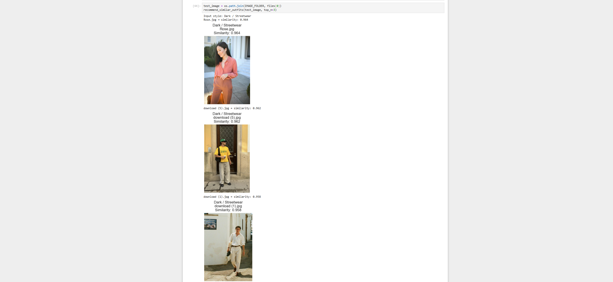

# Outfit Recommender V1

## Overview
This is a content-based recommendation system using unsupervised learning (KMeans clustering and vector similarity)

## How it works
- Extract dominant colors from images using KMeans
- Convert colors into feature vectors
- Compare images using cosine similarity
- Filter recommendations by style group

## Features
- Color-based similarity matching
- Style-based filtering (e.g., streetwear, minimal)
- Visual output of similar outfits

## Example Output

## Limitations
- Focuses primarily on color similarity
- Does not yet capture higher-level fashion semantics (e.g., shape, texture, garment type)

## Technologies
- Python
- NumPy
- Scikit-learn
- Matplotlib
- PIL

## Future Work
- Add brightness and contrast (V2)
- Improve feature representation
- Build a more advanced recommender system

## Author
Ousama

